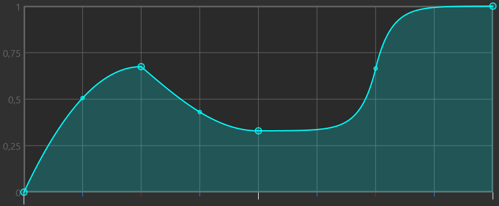

Sliderator is a tool that lets you create sliders or streams which change speed midway through.

To get started, simply import a slider with the controls in the top left and start editing the graph with your right mouse button.

:::caution Unrankable

Sliders made by Sliderator are deemed unrankable, because the changes in speed are unreadable.

:::

## Importing sliders {#importing}

Before you do anything with Sliderator, you need to import one or more sliders with the **Import sliders** button in the top left.
There are 3 ways to import sliders:

- **Selected** imports the sliders which you have currently selected in the osu! editor.
- **Bookmarked** imports any sliders in the current beatmap which have a bookmark on them.
- **Time** imports sliders in the current beatmap which are referenced by a time code which you input in the box next to it. This time code should be the same format as what you get when you copy some objects in the editor and paste it in a text field, so for example: `00:56:823 (1,2,1,2) -`

If you have imported multiple sliders, you can navigate between them with the left and right buttons. Shift-clicking these buttons will make it also quickly sliderate the current slider before moving to the next slider.

Selecting a slider automatically sets the **Beat length**, **BPM**, and **Global SV** values.

## Graph {#graph}

The graph is the most important part of Sliderator and it is where you define the movement of the sliderball over time.

On the X-axis is **time** and its for the entire duration of the slider. The duration in defined in the **Beat length** field.
The beat snap divisor for the lines on the X-axis can be changed with the slider below the graph.

For the Y-axis there are two modes and they can be toggled with the green button below the graph:

- **X** is position mode. Here the Y-axis is the position along the the slider, so you can define exactly where the slider ball must be at what time.
- **V** is velocity mode. Here the Y-axis is the slider velocity multiplier. It ranges between the positive and negative **SV limit**.

### Editing the graph {#editing-graph}

You edit the graph using control points and interpolations. 

To place a new control point, **right-click** anywhere on the graph. Right-clicking on a control point opens a context menu which lets you delete the control point or change its method of interpolation. Use **left-click** to drag around control points.

In the middle of each interpolated section is a smaller control point. Dragging this control point up and down lets you change the shape of the interpolation. **Right-click** on it to reset the control point.

There are also some hotkeys to help with dragging around control points:

- **Shift** to restrict movement to a horizontal plane.
- **Ctrl** to restrict movement to a vertical plane.
- **Alt** to disable snapping.

### Other graph controls {#graph-controls}

This section explains some of the other controls which are related to the graph.

- **Beat length** is the duration of the slider in beats. This also affects the width of the graph.
- **BPM** is the beats-per-minute at which the slider operates. This value should be equal to the BPM at the place where the slider will be exported.
- **Global SV** is the slider multiplier of the beatmap. This value should be equal to the slider multiplier of the current beatmap.
- **SV limit** is the maximum allowed SV in the graph. This also affects the height of the graph in velocity mode. By default this value is 10, because that is the maximum SV allowed in inherited timing points.
- **Scale to completion** lets you scale all control points vertically such that the furthest the sliderball ever travels along the slider is at the wanted completion.
- **Reset graph** lets you reset the graph to the default state.
- **Show red anchors** shows the positions of red anchors in the slider as red horizontal lines in the graph in position mode.
- **Show graph anchors** shows the positions of the graph control points in the slider preview.
- **Expected segment count** shows for your current configuration an estimate of how many slider anchors will be necessary. Anything below 10000 will not lag your game too much.

## Export options {#export-options}

Running Sliderator exports the sliderated slider to the current beatmap at the export time. You can choose to just add to the beatmap or replace whatever is there in the beatmap already with **Override**.

If you check **Export as stream instead** Sliderator will not export a slider but a stream of circles which follows the speed and duration of the slider. This option uses the beat snap divisor of the graph to determine how many circles it will put in each beat.

You can choose to manually choose the **New SV** for the sliderated slider. This SV should approach the maximum speed used in the graph. Usually the automatic value is good enough, but sometimes it can be reduced slightly to get a lower anchor count while not effecting the quality of the sliderated slider.

**Minimum tumour length** is another option you can use to significantly reduce the number of anchors in the resulting slider. Sliderator uses invisible tumours to slow down the slider ball, so increasing the minimum tumour length will cause Sliderator to create bigger tumours, thus using less tumours overal. The only downside is that the bigger tumours make the movement of the sliderball less smooth.

**Delegate SV to BPM** causes Sliderator to use BPM to set the new SV of the slider. This removes the 10x SV limitation of inherited timing points. It also allows you to enable the **Remove slider ticks** option which removes slider ticks from the slider by using an inherited timing point with `NaN` SV.
