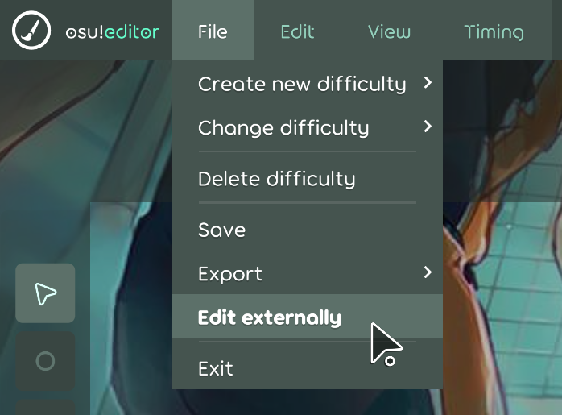

[osu! lazer](https://github.com/ppy/osu) is the future osu! game client and with that comes a new beatmap editor. While Mapping Tools was made for osu! stable, some of its functionality works in osu! lazer as well.

## How to use Mapping Tools in osu! lazer

In the osu! lazer editor, click **File > Edit externally**. This will create a temporary folder with all the files of the beatmap set you are currently editing. It will automatically open the folder for you in the file explorer. You can then drag the file you want to edit into Mapping Tools to set it as the current beatmap. Once you're done editing with Mapping Tools you can click **Finish editing and import changes** and osu! lazer will import the changes.

## Compatibility

Not all features of Mapping Tools work in osu! lazer. This section attempts to list the compatibility of all Mapping Tools features.

Any features that use Editor Reader will not work in osu! lazer, so it is recommended to go to the **Preferences** and disable Editor Reader if you plan on only using osu! lazer.

### General
- :x: Anything **Open current beatmap** does not work
- :x: Anything **Current editor time** does not work
- :x: Anything **Selected hit objects** does not work
- :x: Anything that requires calculating slider paths for sliders with multiple segments does not work
- :white_check_mark: **Generate backup** works
- :white_check_mark: **Load backup** works

### Tools
- :x: **Geometry Dashboard** does not work. Relies on editor reader.
- :white_check_mark: **Hitsound Copier** works
- :large_orange_diamond: **Hitsound Studio** works, but references to imported samples and beatmaps break after the temp folder is removed.
- :large_orange_diamond: **Pattern Gallery** works, but thumbnails render incorrectly for sliders with multiple segments.
- :white_check_mark: **Property Transformer** works
- :large_orange_diamond: **Sliderator** works, but is extremely laggy in lazer editor. Does not work for sliders with multiple segments.
- :large_orange_diamond: **Tumour Generator 2** works, but not for sliders with multiple segments.
- :large_orange_diamond: **Auto-fail Detector** works, but auto-fail does not exist in Lazer.
- :white_check_mark: **Combo Colour Studio** works
- :large_orange_diamond: **Hitsound Preview Helper** works, but custom samples do not work yet in Lazer.
- :white_check_mark: **Map Cleaner** works
- :white_check_mark: **Mapset Merger** works
- :white_check_mark: **Metadata Manager** works
- :white_check_mark: **Rhythm Guide** works
- :large_orange_diamond: **Slider Completionator** works, but length calculation and **Move anchors to new length** do not work for sliders with multiple segments.
- :large_orange_diamond: **Slider Merger** works, but not for sliders with multiple segments.
- :large_orange_diamond: **Slider Picturator** works, but the picture slider does not show up in Lazer.
- :white_check_mark: **Timing Copier** works
- :white_check_mark: **Timing Helper** works

## Heads up about continued lazer compatibility
As osu! lazer continues to evolve, it's file format changes more and more from the stable format, and with that Mapping Tools struggles to keep up with the changes.

If you run into any issues using Mapping Tools on lazer, I recommend this workaround:
- Export your beatmap with stable compatibility: **File > Export > For compatibility (.osz)**
- Open the .osz in osu! stable or extract it with an archive manager (7zip/winrar)
- Select the beatmap .osu file from the .osz in Mapping Tools
- Do your Mapping Tool business
- Import the changed beatmap .osu file back into lazer. You can do this with **File > Edit externally** in the lazer editor, then add the edited .osu file in the folder, or copy individual hitobjects from .osu file to .osu file.

